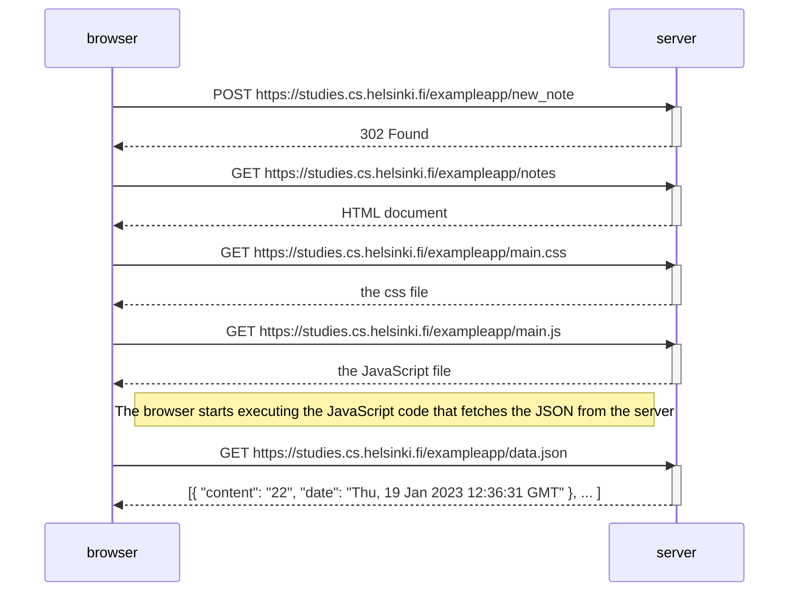

```mermaid
sequenceDiagram;
    participant browser;
    participant server;
    
    browser ->> server: POST https://studies.cs.helsinki.fi/exampleapp/new_note;
    activate server;
    server -->> browser: 302 Found;
    deactivate server;
    
    browser->>server: GET https://studies.cs.helsinki.fi/exampleapp/notes
    activate server
    server-->>browser: HTML document
    deactivate server
    
    browser->>server: GET https://studies.cs.helsinki.fi/exampleapp/main.css
    activate server
    server-->>browser: the css file
    deactivate server
    
    browser->>server: GET https://studies.cs.helsinki.fi/exampleapp/main.js
    activate server
    server-->>browser: the JavaScript file
    deactivate server
    
    Note right of browser: The browser starts executing the JavaScript code that fetches the JSON from the server
    
    browser->>server: GET https://studies.cs.helsinki.fi/exampleapp/data.json
    activate server
    server-->>browser: [{ "content": "22", "date": "Thu, 19 Jan 2023 12:36:31 GMT" }, ... ]
    deactivate server    
    
```
